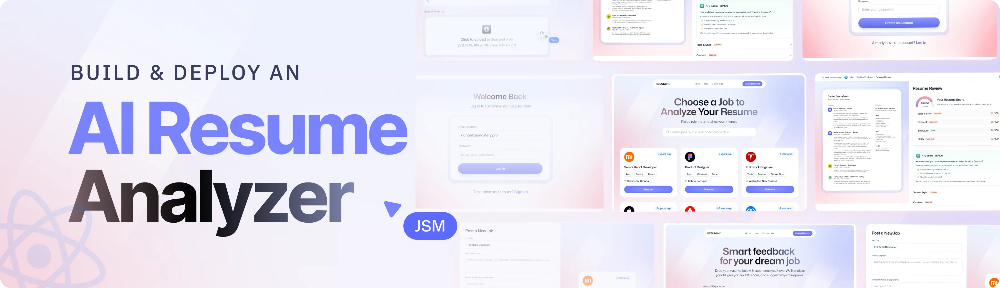

<div align="center">
  <br />
    
  <br />

  <div>
    
    
    
    
  </div>

  <h3 align="center">AI Resume Analyzer</h3>
</div>

## 📋 <a name="table">Table of Contents</a>

1. ✨ [Introduction](#introduction)
2. ⚙️ [Tech Stack](#tech-stack)
3. 🔋 [Features](#features)
4. 🤸 [Quick Start](#quick-start)

## <a name="introduction">✨ Introduction</a>

An AI-powered Resume Analyzer built with React, React Router, and Puter.js. Implements seamless auth, upload and store resumes, and matches candidates to jobs using smart AI evaluations. Get custom feedback and ATS scores tailored to each listing — all wrapped in a clean, reusable UI.

## <a name="tech-stack">⚙️ Tech Stack</a>

- **[React](https://react.dev/)** — Open-source JavaScript library for building user interfaces using reusable components and a virtual DOM.

- **[React Router v7](https://reactrouter.com/)** — Routing library for React apps with nested routes, data loaders/actions, error boundaries, and SSR support.

- **[Puter.js](https://puter.com/)** — Client-side SDK that adds serverless auth, storage, database, and AI directly into your browser app — no backend needed.

- **[Tailwind CSS](https://tailwindcss.com/)** — Utility-first CSS framework for designing custom user interfaces quickly using low-level utility classes.

- **[TypeScript](https://www.typescriptlang.org/)** — Superset of JavaScript that adds static typing for better tooling, code quality, and error detection.

- **[Vite](https://vite.dev/)** — Fast build tool and dev server using native ES modules with hot-module replacement and Rollup-powered production builds.

- **[Zustand](https://github.com/pmndrs/zustand)** — Minimal, hook-based state management library for React with zero boilerplate.

## <a name="features">🔋 Features</a>

👉 **Easy & convenient auth**: Handle authentication entirely in the browser using Puter.js — no backend or setup required.

👉 **Resume upload & storage**: Upload and store all resumes in one place, safely and reliably.

👉 **AI resume matching**: Provide a job listing and get an ATS score with custom feedback tailored to each resume.

👉 **Reusable, modern UI**: Built with clean, consistent components for a great-looking and maintainable interface.

👉 **Code Reusability**: Modular codebase for efficient development.

👉 **Cross-Device Compatibility**: Fully responsive design that works seamlessly across all devices.

## <a name="quick-start">🤸 Quick Start</a>

Follow these steps to set up the project locally on your machine.

**Prerequisites**

Make sure you have the following installed on your machine:

- [Git](https://git-scm.com/)
- [Node.js](https://nodejs.org/en)
- [npm](https://www.npmjs.com/) (Node Package Manager)

**Cloning the Repository**

```bash
git clone https://github.com/TanviKabi1/Resume-Analyzer.git
cd Resume-Analyzer
```

**Installation**

Install the project dependencies using npm:

```bash
npm install
```

**Running the Project**

```bash
npm run dev
```

Open [http://localhost:5173](http://localhost:5173) in your browser to view the project.
